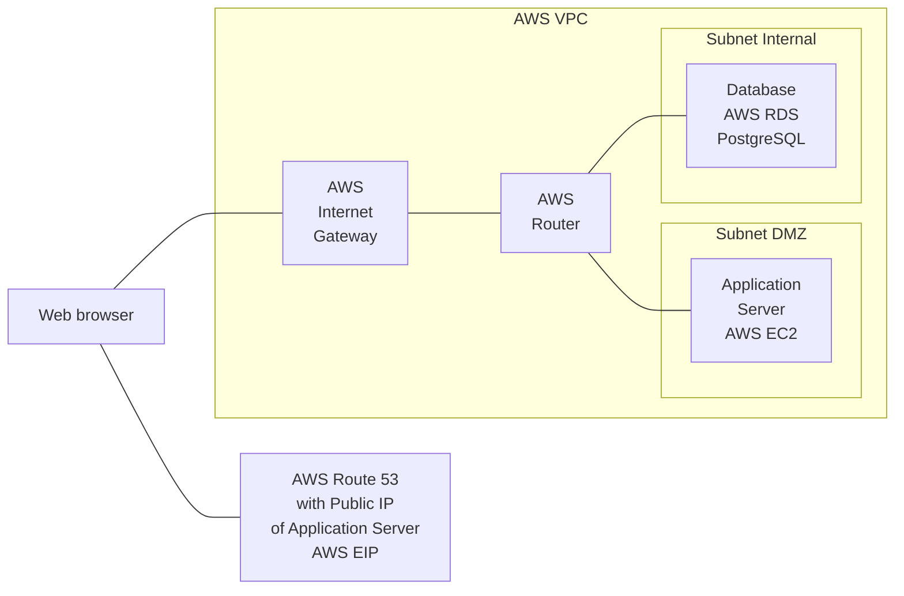

---

## Production environment proposal

To have a not-to-complex start, I propose an initial production environment consisting of a virtual private cloud (VPC), two subnets, one application server, and one database instance.

The VPC has two separate subnets. Subnet "DMZ" for the application server, and subnet "Internal" for the database server. The application server in subnet "DMZ" communicates to the database server in subnet "Internal" via a router.

A public IP address is assigned to the application server's internal IP address, and published in DNS.

An internet gateway accepts communication to the public IP address to the required TCP ports (80/HTTP, 443/HTTPS, and 22/SSH), and -- via the router -- forwards the connections to the application server.

For a painless deployment of application changes, the application is deployed with a continuous integration/deployment platform. Application deployments happen after successfully passing automated tests. Deployments will be triggered manually, or automatically on code changes.

This diagram explains the environment and mentions the related AWS services:

## Questions to the development team

* How much memory/disk does your application and database need as minimum and maximum? (AWS EC2 Instance Type)
* How fast do you expect your database to grow?
* In which frequency do you need a backup of the database to be done? Which database backup retention does your application require?
* In which geographical location(s) are your primary/typical/most users located?
* Do you expect spikes of high usage of your application, and does your application support horizontal scaling (AWS EC2 Auto Scaling)?
* Does your application use an object storage service (AWS S3)?
* Does your application use a persistent key-value-store like Redis (AWS Redis)?
* Does your application use a non-persistent key-value store like Memcached (AWS Memcached)?
* Does your application use a service to send emails (AWS SES)?
* Which branching strategy do you use for the application source code? Do you like continuous deployments of a main/master branch, or based on tags?
* Which automated tests need to pass before a new deployment of your application?
* Which command builds the container image of your application?
* For which situations do you need a review-app for your application (each branch, each pull/merge request, a staging branch)?
* Do you like/need to manually trigger a deployment of your application, or automatically on source code changes?
